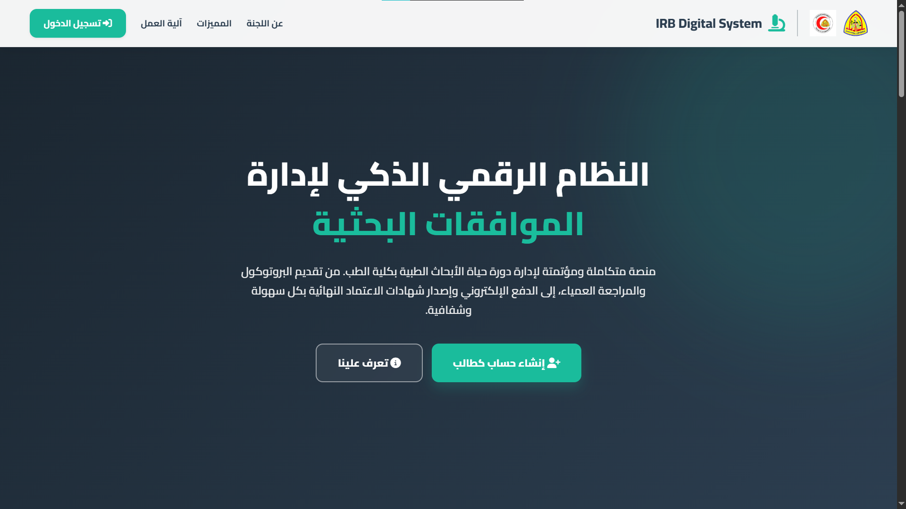
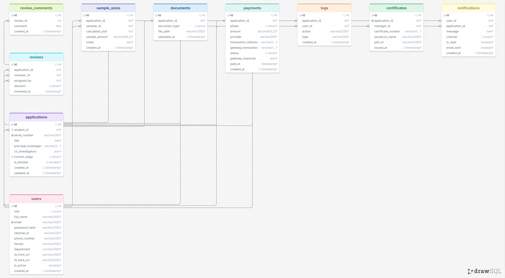

<div align="center">

  
  
  <br>

### STREAMLINING MEDICAL RESEARCH APPROVALS!

  <p>
    <a href="#"></a>
    <a href="#"></a>
    <a href="#"></a>
    <a href="#"></a>
  </p>

</div>

**IRB Digital System** is a _comprehensive management platform_ built to handle the entire lifecycle of research approvals for the Faculty of Medicine. It digitizes the paperwork, securely routes protocols to the right committee members, and tracks every decision in real-time. The system acts as the core engine—managing everything from student submission to the final stamped certificate.

If you want a secure, role-based system with native Arabic (RTL) support and seamless electronic payment integration, this is it.

**Core Workflows include:** Multi-role Authentication (Student, Admin, Sample Officer, Reviewer, Manager), 100% Blind Peer Reviews, Automated Sample Size Fee Calculations, Paymob/Fawry E-Payment Integration, and Dynamic PDF Certificate Generation.

---

## Media & Resources

- **[ Watch the Full Project Explanation Video (Google Drive)](https://drive.google.com/file/d/1DciXIknf7E9OLnDvbYwfmeyc06fR_zaC/view?usp=sharing)** \* **[ View the Complete Requirements Document](https://docs.google.com/document/d/1wLQDK7zc70B3Z7_dANCbzopchhjF9jLEzQO6J_lIqTI/edit?tab=t.0#heading=h.506q4t6lbijn)**
- **Database ERD:**
  <br>
  

---

## User Roles & Permissions

The system handles dynamic routing and permissions for five distinct roles:

1. **Student (الطالب):** Submits research, uploads documents, tracks status, and handles payments.
2. **Admin / IRB Staff (الموظف):** Verifies student identities, activates accounts, and assigns reviewers.
3. **Sample Size Officer (موظف حساب حجم العينة):** Reviews technical protocols and calculates sample sizes for fee generation.
4. **Reviewer (المراجع):** Conducts blind reviews (PI identity hidden), leaves feedback, and approves/rejects submissions.
5. **IRB Committee Manager (مدير اللجنة):** Oversees the entire workflow, analyzes platform metrics, and issues final approval certificates.

---

## Core System Workflow

1. **Registration & Submission:** Students register, upload ID, and submit 7 mandatory PDF documents (Protocol, Consents, Declarations) along with JSON-formatted Co-Investigator data.
2. **Admin Verification:** Admin verifies ID cards and generates a unique `Serial Number`.
3. **Initial Payment:** Student pays a fixed base fee via an electronic gateway (Paymob/Fawry).
4. **Technical Evaluation:** Sample Size Officer calculates the sample size based on the protocol.
5. **Sample Size Payment:** A dynamic fee is generated based on the sample size; the student completes the second payment phase.
6. **Blind Review Process:** Admin assigns reviewers. Reviewers evaluate the anonymized application and submit a decision (Approve/Reject/Modify).
7. **Modification Loop:** If modifications are requested, the student is notified to update documents.
8. **Final Approval:** The Committee Manager conducts a final review of approved applications.
9. **Certification:** System generates a stamped PDF certificate of approval for the student to download.

---

## Contributors & Epic Division

This project is developed collaboratively using a feature-based architecture.

| Team Member | Assigned Epics                               | Core Responsibilities                                                             |
| :---------- | :------------------------------------------- | :-------------------------------------------------------------------------------- |
| **Donia**   | **Epic 1:** IAM                              | Authentication, Role-Based Access Control, Student Onboarding.                    |
| **Azzazy**  | **Epic 2:** Submission Engine                | Application wizard, JSON handling, Document vault (File uploads).                 |
| **Amir**    | **Epic 3 & Epic 4:** FinTech & Tech Eval     | Payment gateway integration, digital receipts, and Sample Size Officer workflows. |
| **Maula**   | **Epic 5:** Blind Review                     | Anonymized dashboard, reviewer assignment, and feedback loop.                     |
| **Hager**   | **Epic 6 & Epic 7:** Final Approval & Alerts | PDF Certificate generation, System logging, Dashboards, and Notifications.        |

---

## Installation & Setup Guide

### 1. Prerequisites

Ensure you have the following installed on your machine:

- A local web server: **XAMPP**, **MAMP**, or **WAMP** (Running Apache & MySQL)
- **Git** installed on your terminal
- **Ngrok** (Required for Paymob Webhook testing)

### 2. Clone the Repository

Open your terminal, navigate to your local server's public directory (e.g., `htdocs` for XAMPP), and clone the repository:

```bash
cd /path/to/your/htdocs
git clone https://github.com/amiresaye6/irb-digital-system.git
cd irb-digital-system
```

### 3. Configure Environment Variables ( Crucial)

To protect database credentials and API keys, we do not upload them to GitHub.

1. Navigate to the `includes/` folder.
2. Duplicate the `env.example.php` file and rename the copy to **`env.php`**.
3. Open `env.php` and update your local database credentials (password, port) and your Paymob API keys.

### 4. Database Setup & Seeding

We have prepared a complete database structure with realistic dummy data for testing.

1. Open **PhpMyAdmin** (`http://localhost/phpmyadmin`).
2. Create a new database named `irb_system` (or matching your `env.php`).
3. Go to the **Import** tab.
4. Choose the file located at `setup/db.sql` in your cloned project folder and click **Import**.

### 5. Payment Gateway Setup (Ngrok)

To test electronic payments (Epic 3), the payment provider needs to send a success callback to your local machine.

1. Start your local server (Apache & MySQL).
2. Open a new terminal window and start Ngrok on your server's port (usually 80):
   ```bash
   ngrok http 80
   ```
3. Copy the generated `https://...ngrok-free.app` URL.
4. Go to your Paymob Dashboard -> Developers -> Payment Integrations.
5. Paste the Ngrok URL into the **Transaction Processed Callback** field (e.g., `https://<your-ngrok-url>/irb-digital-system/features/payment/callback.php`).

### 6. Run the Application

Open your browser and navigate to:
**http://localhost/irb-digital-system/**

---

## Test Accounts (Seed Data)

The database has been pre-seeded with users for every role. **Universal Password:** `password`

| Role               | Name                    | Email                |
| :----------------- | :---------------------- | :------------------- |
| **Student**        | Dr. Omar Al-Farouq      | `omar@med.edu`       |
| **Admin**          | Mr. Mahmoud (Admin)     | `admin@irb.edu`      |
| **Sample Officer** | Eng. Hossam             | `sample1@irb.edu`    |
| **Reviewer**       | Prof. Khaled (Reviewer) | `khaled.rev@irb.edu` |
| **Manager**        | Prof. Tarek (Director)  | `manager@irb.edu`    |

---

## Project Architecture

To prevent Git merge conflicts and keep our code organized, we are using a Feature-Based Architecture:

```text
irb-digital-system/
├── assets/           # Frontend styling (CSS/Tailwind, JS, Images)
├── classes/          # Core OOP logic (Database connection, Auth, Models)
├── features/         # Logic and UI, divided by domain (Admin, Student, Reviewer, Payment)
├── includes/         # Shared components (header.php, footer.php, env.php)
├── setup/            # Database schema and seed files (db.sql)
└── uploads/          # Secure directory for research protocols and ID cards (Git ignored)
```
